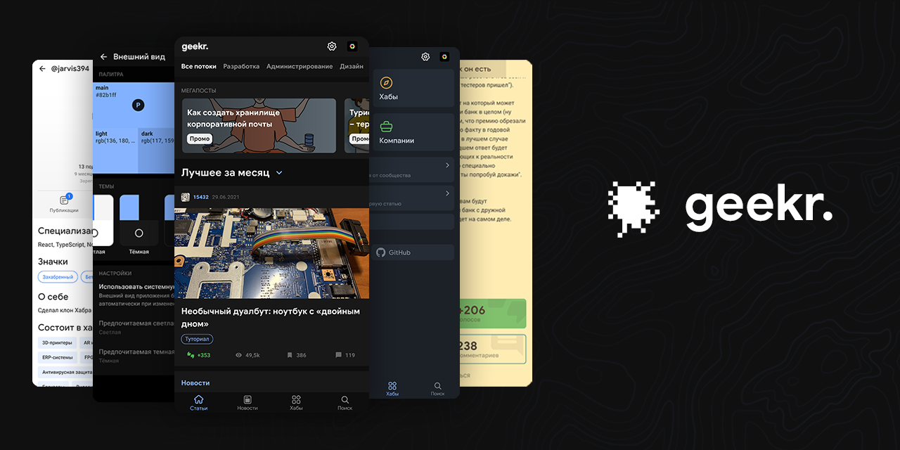

<h5 align="center">✨🎉 Habrahabr, but with a new client</h5>

  
  
  

## See it live

Go to the [geekr.vercel.app](https://geekr.vercel.app/top/weekly/p/1) site and feel yourself at home! It can do almost everything that the original site does, but with its own tricks and features.

## Features

- **Dark mode** 😲 and lots of other themes
- Tons of customization settings and theme creation
- Styled following Material Design
- Mobile friendly
- Coded with React, TypeScript and Redux

## Docs

Click [here](https://jarvis394.gitbook.io/habra) to view docs on GitBook.

## Extensions

Open in "habra.": [habra-redirect](https://github.com/istudyatuni/habra-redirect)

## Contribution

Feel free to contribute as `geekr.` is open-sourced! If you want more contributing information, visit [this page](https://jarvis394.gitbook.io/habra/contributing) about contributing and [this page](https://jarvis394.gitbook.io/habra/self-host/cloning-and-installation) about self-hosting.

## Contributors

## Author

VK: [@tarnatovski](https://vk.com/tarnatovski)

**Habrahabr article**: [click](https://m.habr.com/ru/post/526068/)
